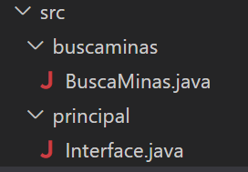

# Busca minas con dos capas
Tienes orientaciones algorítmicas en fichero [orientaciones.md](orientaciones.md)

## Se pide:
- Nombre de proyecto: BuscaMinas
- Separar el interface de usuario de la lógica del juego.  Habrá dos paquetes. Uno se llamará principal y contiene la clase InterfaceConsola que contiene el main() . El otro se llamará buscaminas y contendrá la clase BuscaMinas que controlan la lógica del juego. 

-La clase InterfaceConsola puedes hacerla sencillita para no gastar tiempo con la E/S. Si te apetece hacerla compleja ¡no problem!
- En la clase BuscaMinas todo private excepto lo que se requiera expresamente public. 
- Hay que cumplir en la clase BuscaMinas el principio de ocultación tanto para tipos primitivos como para referencias.
- Generar javadoc para la clase BuscaMinas de forma que leyendo la ayuda de los métodos públicos otro programador que quiera hacer otra Interface, pueda manejar tu clase sin necesidad de leer el código java de tu clase. Esfuérzate en diseñar una parte pública compresible para otros. Recuerda que casi siempre "se escribe el código para otros".
- El proyecto, además de por supuesto el código fuente, contiene  también un jar ejecutable 
